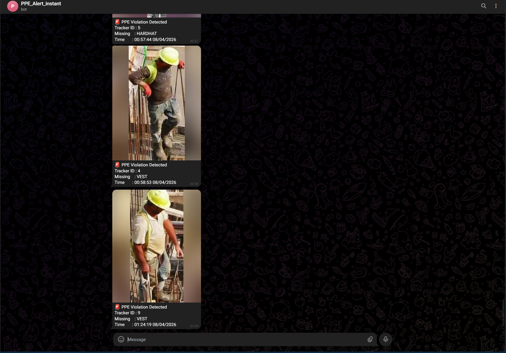
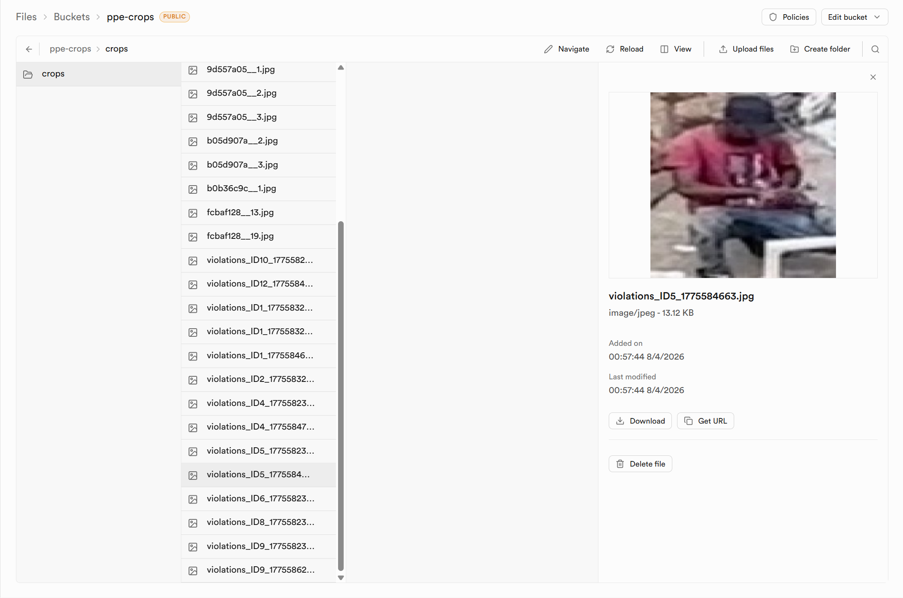
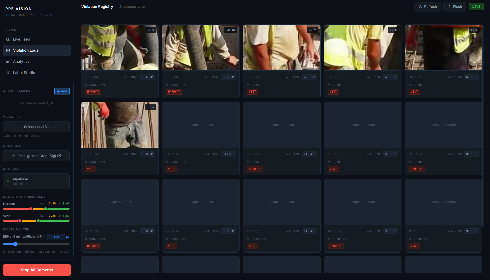
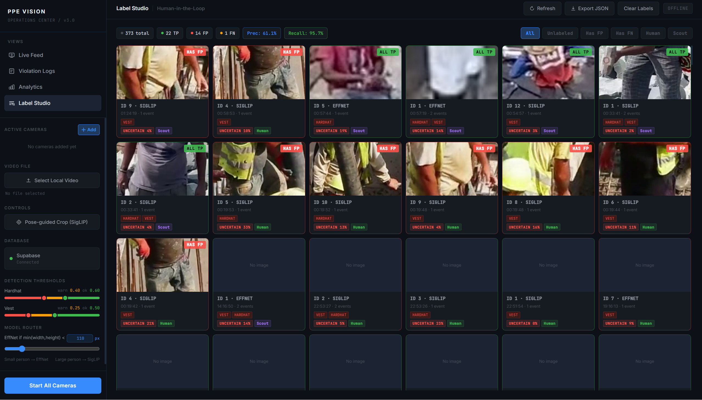

[](https://github.com/nhatminh-115/PPE-Detection/actions/workflows/ci-cd-pipeline.yml)


# PPE Detection

A real-time, cloud-native inference engine for automated Personal Protective Equipment (PPE) compliance monitoring in construction and industrial environments.

The system runs a multi-stage deep learning pipeline that detects violations, sends instant alerts, and generates daily compliance reports grounded in Vietnamese labor regulations (Thong tu 25/2022). It is designed as a closed-loop flywheel: violations feed a human labeling interface, a vision second-opinion agent surfaces disagreements, confirmed labels are versioned to S3, and model drift automatically triggers EfficientNet retraining on an EC2 Spot Instance.

---

## Table of Contents

1. [System Architecture](#1-system-architecture)
2. [Data Flywheel](#2-data-flywheel)
3. [Infrastructure](#3-infrastructure)
4. [Automated Reporting](#4-automated-reporting)
5. [Model Performance](#5-model-performance)
6. [Setup Guide](#6-setup-guide)

---

## 1. System Architecture


| Component | Technology | Role |
|---|---|---|
| Person Detection | YOLO11s + YOLO26l + WBF | Dual-model ensemble, recall-optimized |
| Tracking | ByteTrack + Box EMA | Stable ID assignment, spatial smoothing |
| PPE Classification | SigLIP SO400M (ONNX INT8) / EfficientNetV2-B0 (ONNX) | Zero-shot (large boxes) vs. trained (small boxes) |
| Pose Estimation | YOLO26m-pose | Precise head/torso crop localization for SigLIP |
| State Management | Hysteresis FSM + Classify Lock | Alert fatigue suppression, GPU load reduction |
| Compliance Reporting | LangGraph + Groq LLM + RAG ChromaDB | Regulation-cited daily reports |
| Data Flywheel | S3 + Supabase + EC2 Spot | Automated labeling, drift detection, retraining |
| Infrastructure | Terraform + GitHub Actions | Reproducible AWS provisioning, CI/CD |

### 1.1 Core AI Pipeline

**Stage 1: Detection Ensemble**

The system runs two YOLO detectors in parallel to handle both aerial and close-circuit camera angles:

- **YOLO11s** — fine-tuned on VisDrone for dense, small-scale pedestrian detection.
- **YOLO26l** — COCO-pretrained for high-fidelity close-range detection.
- Detections are fused via **Weighted Boxes Fusion** (WBF, weights=[2,1]) to suppress overlaps, then tracked with **ByteTrack** + Box EMA (α=0.6) for stable IDs and smooth bounding boxes.

Before classification, each person's foot-point is tested against a user-defined polygon zone (`cv2.pointPolygonTest`). Only persons inside the zone are passed downstream.

**Stage 2: Classify Lock FSM**

Each tracker follows a three-state lifecycle to avoid redundant GPU inference:

- **ACTIVE (0–20s):** Classify every frame; lock after 3 consecutive stable verdicts.
- **LOCKED:** Cached verdict reused, inference skipped entirely.
- **FORCE RECHECK:** Triggered after 20s of lock age or when confidence drops below threshold.

**Stage 3: Pose-Guided PPE Classification**

Classification is routed by bounding box size:

- **Small boxes (min side < 110px) → EfficientNetV2-B0:** Full-body crop with 10% padding. Trained on the Ultralytics PPE dataset (F1=0.92). Inference runs via ONNX Runtime; inputs are automatically chunked if the exported model has a fixed batch dimension.

- **Large boxes (min side ≥ 110px) → SigLIP SO400M (ONNX INT8):** Zero-shot classification using text prompts. YOLO26m-pose runs every 9 frames to extract COCO keypoints and define precise crop regions:
  - *Hardhat crop:* Head keypoints (indices 0–4), 45% padding.
  - *Vest crop:* Torso keypoints (indices 5, 6, 11, 12), 25% padding.
  - *Fallback:* Fixed-percentage crop when pose confidence is insufficient.

  The image encoder runs via ONNX Runtime INT8 (`SIGLIP_ONNX_ENABLED=1`), reducing model size from 1632 MB to 411 MB. The PyTorch model is loaded once at startup for text embedding pre-computation, then offloaded to free ~1.6 GB RAM. Text embeddings and `logit_scale` are cached for the lifetime of the process.

  HSV Color Priors post-process the hardhat probability: white/yellow pixels in the head ROI add a boost (+0.10–0.12), dark pixels apply a penalty (−0.14).

[](https://huggingface.co/spaces/Nhatminh1234/ppe-classifier) — Try the PPE classifier online.

### 1.2 State Management & Alerting

- **Hysteresis FSM:** Controls SAFE → WARN → VIOLATION transitions with strict margins to prevent oscillation. EMA smoothing (α=0.5) is applied to raw probabilities before state evaluation.

- **Per-Item Accumulation:** Each PPE item (hardhat, vest) maintains an independent 3-second accumulation timer that only increments while that item is in VIOLATION state, and resets on recovery.

- **Per-Item Cooldown:** A 5-minute cooldown is tracked per item per camera session, keyed by `(session_id, tracker_id)`. Full recovery (all items back to state=2) clears all cooldowns for that tracker; partial recovery does not.

- **Violation Logging:** Events are written asynchronously to Supabase PostgreSQL with a JSONB schema and a localized crop image.

- **Instant Telegram Alert:** Each confirmed violation dispatches a Telegram notification with the crop image, in parallel with the Supabase insert.

### 1.3 Multi-Camera Architecture

- Cameras are registered via **CameraRegistry**, each assigned a unique `cam_id` and `session_id`.
- Each camera runs a dedicated **inference thread** with isolated tracker, EMA, FSM, and classify lock state.
- A **producer-consumer pipeline** decouples frame I/O from GPU inference via bounded queues.
- Streams are served at `/video_feed/{cam_id}` and composited into a responsive grid.
- Zone polygons are stored per-camera and persist across restarts.

---

## 2. Data Flywheel

The system implements a closed-loop retraining pipeline that continuously improves EfficientNet from real production data.

```
Violations (Supabase)
  └── Second Opinion Agent (Groq Scout — skips already-labeled events)
    └── Human Labeling (Label Studio UI)
      └── S3 Export (human-confirmed only)
        └── Drift Monitor
          ├── Scout disagreement (early-warning observability)
          └── Human-confirmed disagreement (retrain trigger)
            └── EC2 Spot Retrain (EfficientNet fine-tune → MLflow)
```

### 2.1 Vision Second Opinion Agent

A Groq vision agent (Llama 4 Scout) runs nightly on uncertain violation events. It skips events already labeled (human or auto), and auto-labels remaining events as `has-fp`, `has-fn`, or `all-correct` — writing to `ppe_labels` with `is_auto_labeled=True`. Disagreements surface as pre-labeled cards in Label Studio for human review and become high-value retraining candidates.

### 2.2 Human-in-the-Loop Labeling

The Label Studio tab surfaces merged violation events (keyed by `session_id:tracker_id`) as label cards. Annotators confirm or reject model predictions; verdicts are derived server-side as TP/FP/FN/TN per PPE item. Crops are upscaled with Real-ESRGAN x4 (74ms/crop, +38% sharpness recovery) before storage.

### 2.3 S3 Dataset Versioning

Confirmed human labels and crops are exported to S3 daily:

```
ppe-flywheel/
  crops/dt=YYYY-MM-DD/<sha256>.jpg     # deduplicated by SHA-256
  labels/dt=YYYY-MM-DD/labels.jsonl    # label manifest
  terraform/state/terraform.tfstate    # Terraform remote state
```

### 2.4 Drift Monitor & Retrain Trigger

Two daily disagreement signals are computed:

```
scout_disagreement_rate  = (has-fp + has-fn on Scout labels) / total Scout labels
human_disagreement_rate  = (has-fp + has-fn on human labels) / total human labels
```

Retrain is triggered when both conditions are met:
- 7-day rolling `human_disagreement_rate > DRIFT_THRESHOLD` (default 0.25)
- Total confirmed human labels `>= MIN_CONFIRMED_SAMPLES` (default 100)

Scout disagreement is tracked separately as an early-warning metric. When triggered, a GitHub Actions workflow launches an EC2 Spot Instance (t3.medium) that runs `training/retrain_effnet.py`, exports `weights/best_flywheel_effnet.pt` and `weights/effnet_ppe.onnx`, and self-terminates.

---

## 3. Infrastructure

### 3.1 AWS Resources (Terraform-managed)

All AWS resources are defined in `terraform/` and provisioned via Terraform >= 1.10.

| Resource | Description |
|---|---|
| S3 Bucket | Flywheel dataset storage (versioned, AES-256, lifecycle to S3-IA/Glacier) |
| EC2 Launch Template | t3.medium Spot, Amazon Linux 2023, IMDSv2 enabled |
| IAM Role | Instance profile with S3 read/write and self-terminate permissions |
| Security Group | Outbound-only (Docker pull, S3, MLflow, Supabase) |

Remote state is stored in the same S3 bucket at `terraform/state/terraform.tfstate` using native S3 locking (no DynamoDB required — Terraform 1.10+).

### 3.2 CI/CD Workflows

| Workflow | Trigger | Action |
|---|---|---|
| `ci-cd-pipeline.yml` | Push to `main` | Run pytest, build and push Docker image to Docker Hub |
| `daily_report.yml` | 23:00 ICT daily | Second opinion → LangGraph report → S3 export → drift monitor → Telegram |
| `retrain_trigger.yml` | 23:30 ICT daily | Check drift signal → launch EC2 Spot Instance if triggered |
| `terraform.yml` | Push/PR on `terraform/**` | Terraform plan (PR) / apply (main) |

### 3.3 Artifact Registry

| Artifact | Location |
|---|---|
| Docker image | Docker Hub — `nhatminh115/ppe_system:latest` |
| EffNet ONNX | MLflow on DagsHub — auto-discovered: latest finished run with `export_onnx=success` in `PPE_Stage2_Classification_`, stable fallback `af05de89` |
| SigLIP ONNX INT8 | HF Hub — `Nhatminh1234/siglip-so400m-ppe-int8` (downloaded automatically at startup if `SIGLIP_ONNX_ENABLED=1`) |
| Dataset | S3 — `ppe-flywheel/ppe-flywheel/` |

---

## 4. Automated Reporting

A reporting pipeline runs daily at 23:00 ICT via GitHub Actions.

**Pipeline:** Pull violation logs → Second Opinion Agent → RAG lookup on Thong tu 25/2022 → Groq LLM narrative → S3 export → drift monitor → Telegram + Supabase.

**RAG Layer:** The knowledge base indexes 229 pages of Thong tu 25/2022/TT-BLDTBXH (428 chunks) into ChromaDB using `paraphrase-multilingual-MiniLM-L12-v2` embeddings. Detected violation types generate Vietnamese queries, retrieve top-k regulation chunks, and inject them as grounded context into the Groq prompt — so reports cite specific Dieu numbers and Phu luc I page entries rather than generic safety advice.

| Component | Technology |
|---|---|
| LLM | Groq API (Llama 3.3 70B) |
| Orchestration | LangGraph 4-agent pipeline |
| Vector Store | ChromaDB (persistent, cosine similarity) |
| Embedding Model | paraphrase-multilingual-MiniLM-L12 |
| Notification | Telegram Bot API |
| Storage | Supabase `daily_reports` table |

**Daily Report (Supabase):**


**Telegram Notifications:**



---

## 5. Model Performance

### Detection Ensemble (VisDrone val set, 548 images)

| Model | Precision | Recall | mAP@50 | FPS |
|---|---|---|---|---|
| YOLO11s (fine-tuned) | 0.760 | 0.611 | 0.684 | 45.8 |
| YOLO26l (pretrained) | 0.590 | 0.356 | 0.418 | 22.3 |
| **WBF Ensemble** | **0.556** | **0.764** | — | ~18* |

*End-to-end throughput with pose model (POSE_EVERY=9) on NVIDIA RTX 5070.

> The ensemble trades precision for recall (0.764 vs 0.611) to ensure zero missed violations. Residual false positives are suppressed downstream by the classification stage.

### PPE Classifier (Ultralytics PPE dataset)

| Model | Precision | Recall | F1 | Notes |
|---|---|---|---|---|
| EfficientNetV2-B0 | 0.97 | 0.88 | 0.92 | Trained, handles small boxes |
| SigLIP SO400M | — | — | — | Zero-shot, handles large boxes |

### ONNX Export (EfficientNetV2-B0, CPU)

| Format | Latency | Throughput | Size |
|---|---|---|---|
| PyTorch (CPU) | ~45 ms | ~22 FPS | 22.4 MB |
| ONNX FP32 (CPU) | 7.46 ms | 134 FPS | 22.4 MB |

> ~6x speedup via ONNX Runtime graph optimization. Stable artifact: [MLflow Run](https://dagshub.com/nhatminh-115/PPE-Detection.mlflow) → run `af05de89dacb4aaf893c68a2e4552ba3`.

### ONNX INT8 Export (SigLIP SO400M image encoder, CPU)

| Format | Size | Cosine similarity vs PyTorch | Decision flip rate (19 crops) |
|---|---|---|---|
| PyTorch FP32 | 1632 MB | — | — |
| ONNX INT8 (dynamic) | 411 MB | 0.994 | 5.3% |

> Dynamic INT8 quantizes MatMul/Gemm layers only; LayerNorm and attention scores remain FP32. Expected for large ViT PTQ — cosine similarity 0.990+ is the acceptance threshold. To regenerate: `python scripts/export_siglip_onnx.py`. To evaluate parity on new crops: `python scripts/eval_siglip_onnx.py`.

### LLM Report Quality

Evaluated across 10 synthetic violation scenarios (LLM-as-judge, Gemini 3.1 Pro):

| Criterion | Score |
|---|---|
| Factual Accuracy | 5.0 / 5 |
| Regulation Citation | 5.0 / 5 |
| Specificity | 5.0 / 5 |
| Actionability | 3.9 / 5 |
| Conciseness | 5.0 / 5 |
| **Overall** | **4.8 / 5** |

**Training Metrics**


**Database & UI**








**Video Demo**

https://github.com/user-attachments/assets/56d2bce2-6f40-4413-a22e-83af942a0876

---

## 6. Setup Guide

Choose the path that matches your use case:

| Path | Who it's for |
|---|---|
| [Path A: Run from source](#path-a-run-from-source) | Developers, researchers, anyone who wants to read or modify the code |
| [Path B: Deploy without source](#path-b-deploy-without-source) | Ops teams deploying a pre-built image to a server — no code changes needed |

Steps 1–5 (external services, Supabase, RAG, AWS, GitHub Actions) are shared by both paths.

---

### Before you begin — required external services

Both paths require accounts on the following services. Set these up first and keep the credentials handy for Step 1.

| Service | What you need | Free tier |
|---|---|---|
| [Supabase](https://supabase.com) | Project URL, anon key, service role key | Yes |
| [DagsHub](https://dagshub.com) | MLflow tracking URI, username, token | Yes |
| [Groq](https://console.groq.com) | API key | Yes |
| Telegram | Bot token + chat ID (via [@BotFather](https://t.me/BotFather)) | Yes |
| AWS | Access key + secret key with S3/EC2/IAM permissions | Pay-per-use |

---

### Step 1 — Configure environment variables

Create a `.env` file with your credentials (never commit this file):

```env
# Supabase
SUPABASE_URL=https://your-project.supabase.co
SUPABASE_KEY=your_anon_key
SUPABASE_SERVICE_KEY=your_service_role_key

# MLflow (DagsHub)
MLFLOW_TRACKING_URI=https://dagshub.com/your-username/PPE-Detection.mlflow
MLFLOW_TRACKING_USERNAME=your_dagshub_username
MLFLOW_TRACKING_PASSWORD=your_dagshub_token

# LLM & reporting
GROQ_API_KEY=your_groq_key
TELEGRAM_BOT_TOKEN=your_bot_token
TELEGRAM_CHAT_ID=your_chat_id

# Data flywheel
S3_BUCKET=your-s3-bucket-name
S3_PREFIX=ppe-flywheel
AWS_ACCESS_KEY_ID=your_access_key
AWS_SECRET_ACCESS_KEY=your_secret_key
AWS_DEFAULT_REGION=us-east-1

# Feature flags
REPORT_USE_LANGGRAPH=1
SECOND_OPINION_THRESHOLD=1.0
CLEANUP_SECRET=your_random_cleanup_secret
MUTE_THIRD_PARTY_STARTUP_LOGS=1
QUIET_GET_ACCESS_LOGS=1

# SigLIP ONNX INT8 — auto-downloaded from HF Hub on first startup
SIGLIP_ONNX_ENABLED=1
SIGLIP_ONNX_PATH=model_cache/siglip_image_encoder.onnx
SIGLIP_ONNX_HF_REPO=Nhatminh1234/siglip-so400m-ppe-int8
```

---

### Step 2 — Set up the Supabase database

#### Option A: Consolidated schema (recommended)

1. Open your Supabase project → **SQL Editor** → **New query**.
2. Paste the contents of [`supabase/consolidated_schema.sql`](supabase/consolidated_schema.sql).
3. Run the query.

This creates all five tables in one step: `ppe_labels`, `ppe_label_audit`, `ppe_violations`, `daily_reports`, `drift_log`.

#### Option B: Sequential migrations

```
001_ppe_labels.sql             — Core tables: ppe_labels, ppe_label_audit, RLS
002_ppe_labels_sha256.sql      — Crop deduplication
003_daily_reports_phase2.sql   — Quality metrics & systemic flags
004_ppe_labels_auto.sql        — Auto-labeled rows (Scout)
005_drift_log.sql              — Drift monitoring table
006_ppe_labels_expire.sql      — Retention policy columns
007_drift_log_human_signal.sql — Human vs Scout disagreement signals
```

```bash
supabase migration up
```

#### Create the storage bucket

In **Supabase Storage**: create a new bucket named `ppe-crops` and set it to **Public** (server-side RLS restricts access).

#### Verify

```sql
SELECT tablename FROM pg_tables WHERE schemaname = 'public' ORDER BY tablename;
-- Expected: daily_reports, drift_log, ppe_label_audit, ppe_labels, ppe_violations
```

---

### Step 3 — Build the RAG index (optional)

Skip this step if `data/chroma_db` already exists in the repository or deployment artifact. Only run it when the regulation source document changes:

```bash
python rag/ingest.py
```

---

### Step 4 — Provision AWS infrastructure

Install [Terraform >= 1.10](https://developer.hashicorp.com/terraform/install), then authenticate with AWS:

```bash
aws configure
# Enter: Access Key ID, Secret Access Key, region (us-east-1), leave output format blank
```

```bash
cd terraform
cp backend.hcl.example backend.hcl
# Edit backend.hcl: set your S3 bucket name and region

terraform init -backend-config=backend.hcl
terraform plan
terraform apply
```

Save the outputs — you'll need them in Step 5:

```bash
terraform output retrain_launch_template_id
terraform output retrain_subnet_id
```

---

### Step 5 — Configure GitHub Actions

Go to your GitHub repo → **Settings → Secrets and variables → Actions**.

**Secrets:**

| Secret | Description |
|---|---|
| `SUPABASE_URL` | Supabase project URL |
| `SUPABASE_KEY` | Supabase anon key |
| `SUPABASE_SERVICE_KEY` | Supabase service role key |
| `MLFLOW_TRACKING_URI` | MLflow tracking URI |
| `MLFLOW_TRACKING_USERNAME` | MLflow/DagsHub username |
| `MLFLOW_TRACKING_PASSWORD` | MLflow/DagsHub token |
| `GROQ_API_KEY` | Groq API key |
| `TELEGRAM_BOT_TOKEN` | Telegram bot token |
| `TELEGRAM_CHAT_ID` | Telegram chat ID |
| `S3_BUCKET` | S3 bucket name |
| `AWS_ACCESS_KEY_ID` | AWS access key |
| `AWS_SECRET_ACCESS_KEY` | AWS secret key |
| `DOCKERHUB_USERNAME` | Docker Hub username |
| `DOCKERHUB_TOKEN` | Docker Hub access token |

**Variables:**

| Variable | Default | Description |
|---|---|---|
| `AWS_DEFAULT_REGION` | `us-east-1` | AWS region |
| `S3_PREFIX` | `ppe-flywheel` | S3 key prefix |
| `RETRAIN_LAUNCH_TEMPLATE_ID` | — | From `terraform output` |
| `RETRAIN_SUBNET_ID` | — | From `terraform output` |

---

### Path A: Run from source

For developers and anyone who wants to read or modify the code.

**Requirements:** Python 3.11+, CUDA 12.8+, an NVIDIA GPU.

```bash
git clone https://github.com/nhatminh-115/PPE-Detection.git
cd PPE-Detection
# Place your .env file here (from Step 1)
python main.py
```

To run via Docker instead (useful for a consistent environment):

```bash
docker-compose up --build -d
docker-compose logs -f ppe_inference_engine
```

---

### Path B: Deploy without source

For deploying a pre-built image to a server without cloning the repository.

**Requirements:** Docker 24.0+, Docker Compose 2.0+, NVIDIA Container Toolkit, CUDA 12.8+.

```bash
# Copy your .env file to the server (from Step 1), then:
docker pull nhatminh115/ppe_system:latest

docker run -d \
  --gpus all \
  --name ppe_inference \
  -p 8000:8000 \
  --env-file .env \
  -v $(pwd)/model_cache:/app/model_cache \
  -v $(pwd)/violation_crops:/app/violation_crops \
  -v $(pwd)/temp_uploads:/app/temp_uploads \
  nhatminh115/ppe_system:latest
```

Secrets are never baked into the image — Docker reads them from the `.env` file only at container start.

#### Verify

```bash
docker ps | grep ppe
curl http://localhost:8000/api/health
docker logs -f ppe_inference
docker exec ppe_inference nvidia-smi
```

#### Troubleshooting

| Symptom | Fix |
|---|---|
| CUDA out of memory | Reduce batch size in `src/config.py`; SigLIP ONNX INT8 is enabled by default and frees ~1.6 GB GPU RAM vs PyTorch |
| Image pull fails | Run `docker login` first |
| GPU not detected | Verify NVIDIA Container Toolkit: `docker run --rm --runtime=nvidia nvidia/cuda:12.8-runtime nvidia-smi` |
| Port 8000 in use | Change the host port in the `docker run` command: `-p 8001:8000` |

---

### Step 7 — Access the dashboard

Open `http://localhost:8000/` in your browser.

| Endpoint | Description |
|---|---|
| `/` | Main dashboard |
| `/video_feed/{cam_id}` | Per-camera live stream |
| `/api/violations` | Violation audit log |
| `/api/labels` | Label store |
| `/api/cameras` | Camera registry |
| `/api/second_opinion/run?date=YYYY-MM-DD` | Trigger second opinion agent |
| `/api/report/generate?date=YYYY-MM-DD` | Trigger daily report |

#### Adding cameras

```bash
# Add a webcam
curl -X POST "http://localhost:8000/api/cameras/add_webcam?camera_index=0&label=Zone+A"

# Add an RTSP stream
curl -X POST "http://localhost:8000/api/cameras/add_rtsp?url=rtsp://...&label=Gate+Camera"

# List active cameras
curl "http://localhost:8000/api/cameras"
```

Or use the dashboard: click **Add** → select Webcam or RTSP → assign a label.

#### Defining a detection zone

1. Add a camera and start the stream.
2. Hover over a camera cell → click **+ ZONE**.
3. The stream pauses on a frozen frame.
4. Click to place polygon vertices; click the first point to close the polygon.
5. Click **Save Zone** — inference resumes and only persons within the zone are checked.
