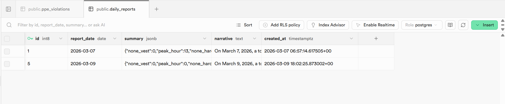
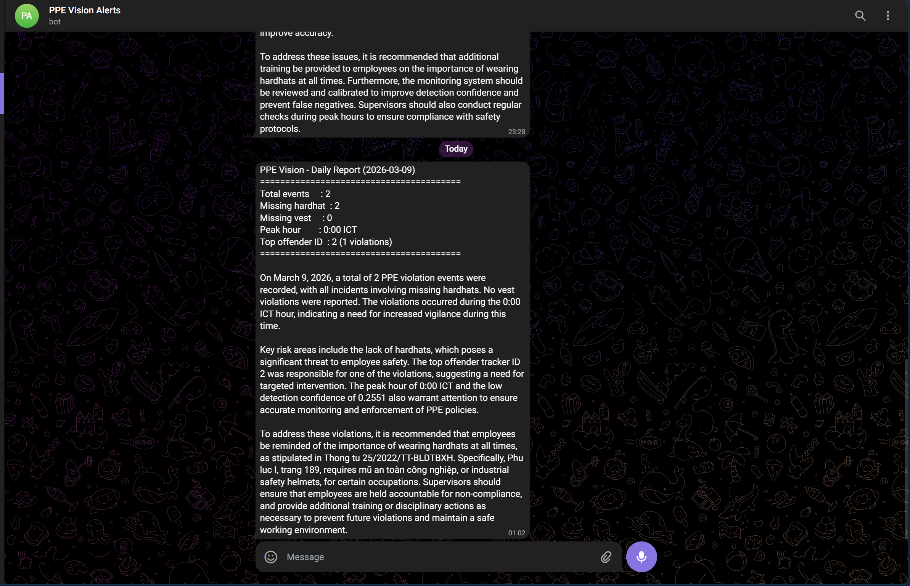
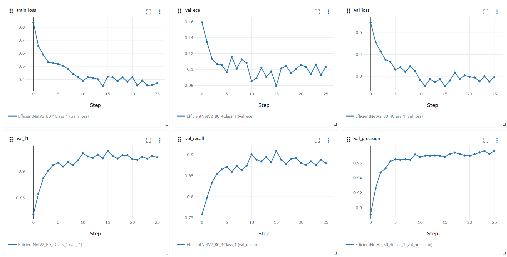
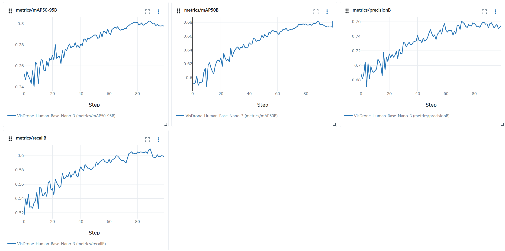
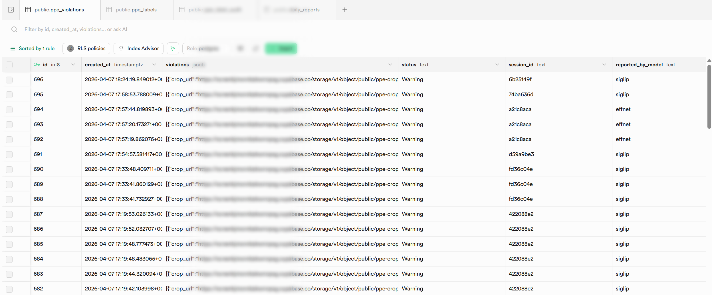
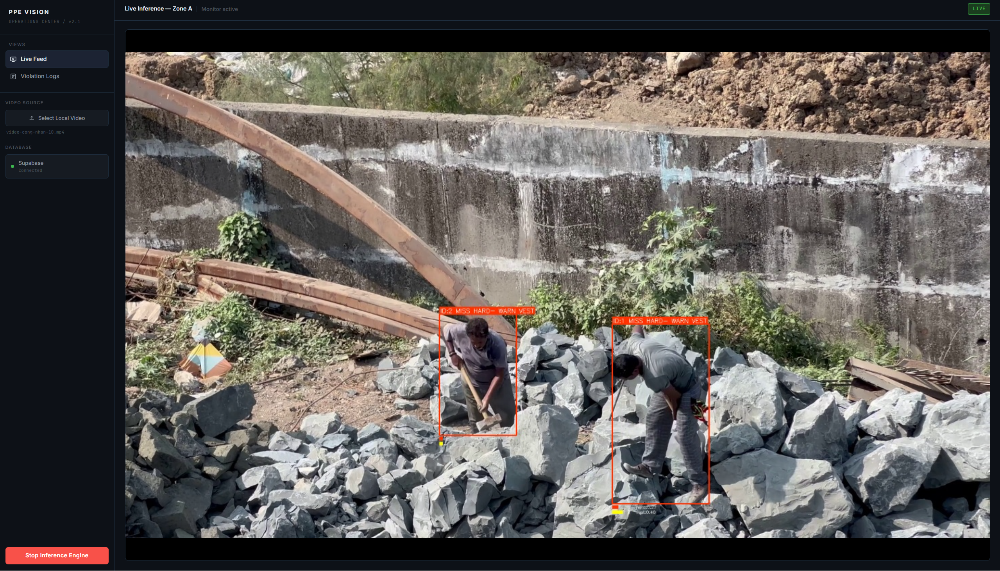
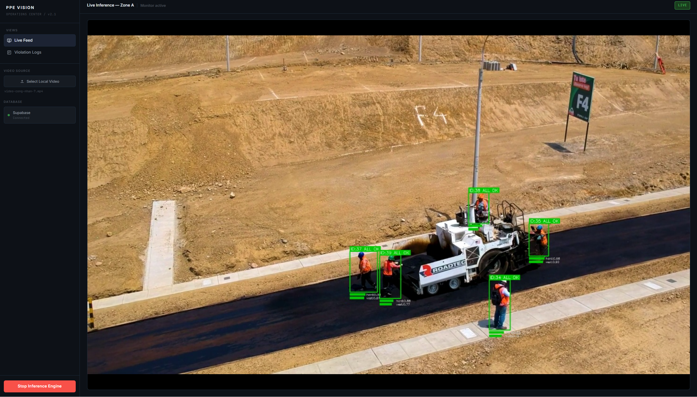

[](https://github.com/nhatminh-115/PPE-Detection/actions/workflows/ci-cd-pipeline.yml)


# PPE Detection

PPE Vision is a real-time, cloud-native inference engine for autonomous Personal Protective Equipment (PPE) compliance monitoring. Engineered for high-stakes construction and industrial environments, the system integrates a multi-stage deep learning pipeline with a compliance reporting layer grounded in Vietnamese labor regulations.

---

## 1. System Architecture Overview


| Component | Technology | Role |
|---|---|---|
| Person Detection | YOLO11s + YOLO26l + WBF | Dual-model ensemble, recall-optimized |
| Tracking | ByteTrack + Box EMA | Stable ID assignment, spatial smoothing |
| PPE Classification | SigLIP SO400M / EfficientNetV2-B0 | Zero-shot (large) vs trained (small), routed by box size |
| Pose Estimation | YOLO26m-pose | Precise head/torso crop localization for SigLIP |
| State Management | Hysteresis FSM + Classify Lock | Alert fatigue suppression, GPU load reduction |
| Compliance Reporting | Groq LLM + RAG ChromaDB | Regulation-cited daily reports |

### 1.1 Core AI Pipeline

**Stage 1: Spatial-Temporal Detection Ensemble**

To mitigate domain shift between varying camera angles (aerial vs. close-circuit), the system implements a dual-YOLO ensemble alongside a dedicated pose estimator:

* **Primary Detector:** YOLO11s fine-tuned on VisDrone for dense, small-scale pedestrian detection.
* **Secondary Detector:** COCO-pretrained `yolo26l.pt` for high-fidelity close-range detection.
* **Fusion & Tracking:** Detections are fused via Weighted Boxes Fusion (WBF, weights=[2,1]) to suppress redundant overlaps. ByteTrack assigns stable tracker IDs across frames, coupled with Box EMA (α=0.6) to eliminate spatial jittering.

**Zone-Based Spatial Filtering**

Before classification, detections are filtered through a user-defined polygon zone. Each person's foot-point (bottom-center of bounding box) is tested via `cv2.pointPolygonTest`. Only persons inside the zone are passed downstream — eliminating irrelevant detections from background areas.

**Stage 2: Classify Lock FSM**

To reduce redundant GPU inference, each tracker follows a three-state lifecycle:

* **ACTIVE (0–20s):** Classify every detection frame. Requires 3 consecutive stable verdicts before locking.
* **LOCKED:** Cached verdict is reused. Inference is skipped entirely.
* **FORCE RECHECK:** Triggered after 20s of lock age, or when verdict confidence drops below threshold.

**Stage 3: Pose-Guided PPE Classification**

Classification is routed by bounding box size:

* **Small boxes (min side < 110px) → EfficientNetV2-B0:** Full-body crop with 10% padding. Trained on processed Ultralytics PPE dataset (F1=0.92). Lightweight and fast for distant detections.

* **Large boxes (min side ≥ 110px) → SigLIP SO400M:** Zero-shot classification using text prompts. YOLO26m-pose runs every 9 frames to extract COCO keypoints and define precise crop regions:
  * **Hardhat crop:** Head keypoints (nose, eyes, ears — indices 0–4), pad 45%.
  * **Vest crop:** Torso keypoints (shoulders, hips — indices 5, 6, 11, 12), pad 25%.
  * **Fallback:** Fixed-percentage crop (top 42% for head, 20–85% for torso) when pose confidence is insufficient.

  After SigLIP inference, **HSV Color Priors** post-process the hardhat probability:
  * White pixel ratio (S≤58, V≥148) in head ROI → +0.12 boost
  * Bright pixel ratio (white ∪ yellow) → +0.10 boost
  * Dark pixel ratio (V≤72, ratio≥22%) → −0.14 penalty

**HuggingFace Spaces demo:** [](https://huggingface.co/spaces/Nhatminh1234/ppe-classifier)

### 1.2 State Management & Observability

* **Hysteresis FSM:** Controls SAFE → WARN → VIOLATION transitions with strict margins to prevent oscillation. EMA smoothing (α=0.5) is applied to raw classification probabilities before state evaluation, enabling faster PPE state response while filtering frame-level noise.

* **Per-Item Temporal Accumulation:** Each PPE item (hardhat, vest) maintains an independent 3-second accumulation timer. A timer increments only while that specific item is in the VIOLATION state (state=0), and resets to zero the moment the item recovers. A brief absence on one item cannot consume time toward another item's threshold — accumulation is fully decoupled. An item must be continuously missing for 3 seconds before a violation event is triggered.

* **Per-Item Violation Cooldown:** A 5-minute cooldown is tracked independently per PPE item per camera session. Hardhat and vest each maintain their own cooldown timers; reporting one does not affect the other. Cooldown state is keyed by `(session_id, tracker_id)` to enforce strict cross-camera isolation — the same physical tracker ID on two different cameras never shares cooldown state.

  Recovery semantics are strict by design:
  * **Full recovery** (all PPE items back to state=2, green) clears all per-item cooldowns for that tracker, so the next violation event is treated as a fresh incident.
  * **Partial recovery** (e.g. vest restored, hardhat still missing) does NOT reset the hardhat cooldown. The existing timer stands, preventing duplicate reports from partial state oscillation.
  * **WARN state** (state=1) is explicitly not a recovery condition. EMA oscillation through the ambiguous zone does not reset any cooldown or re-arm the violation timer — only a confirmed full-green state does.

* **Idempotent Event Logging:** Violations are logged asynchronously (Fire-and-Forget ThreadPool) to Supabase PostgreSQL with a JSONB schema, alongside a localized crop image for manual auditing.

* **Instant Telegram Alert:** Each confirmed violation dispatches a Telegram notification with the crop image attached, in parallel with the Supabase insert.

### 1.3 Multi-Camera Architecture

* Each camera is registered dynamically via **CameraRegistry** and assigned a unique `cam_id` and `session_id`.
* Every camera spawns a dedicated **inference thread** with isolated tracker, EMA, FSM, and classify lock state.
* A **producer-consumer pipeline** decouples frame I/O from GPU inference via bounded queues, eliminating GPU idle time.
* Streams are served at `/video_feed/{cam_id}` and composited into a responsive grid in the UI.
* **Zone polygons** are stored per-camera and persist across stream restarts.

---

## 2. Infrastructure

* **Artifact Fetching:** YOLO11s weights and EfficientNetV2-B0 weights are fetched from the MLflow DagsHub Registry via `run_id`, with local cache collision-avoidance. SigLIP SO400M is loaded via `open_clip` at startup.
* **GPU Acceleration:** All inference runs on CUDA. Models are warmed up at startup to avoid first-frame latency spikes. YOLO models use explicit `device=` parameters to prevent CPU fallback.
* **Containerization:** The engine is packaged as a Docker image. `docker-compose.yml` mounts persistent volumes for model cache and blob storage with NVIDIA GPU passthrough.
* **Continuous Integration:** GitHub Actions provisions a mock environment and executes `pytest` with `unittest.mock` before each Docker registry push.

---

## 3. Automated Reporting & Compliance Intelligence

An automated reporting pipeline runs daily at 23:00 ICT via GitHub Actions cron.

**Pipeline:** Pull violation logs from Supabase → RAG lookup on Thông tư 25/2022 → Groq LLM generates narrative → dispatch to Telegram + save to Supabase.

**RAG Layer:** The knowledge base indexes 229 pages of Thông tư 25/2022/TT-BLĐTBXH (428 chunks) into ChromaDB using `paraphrase-multilingual-MiniLM-L12-v2` embeddings. Violation types detected automatically generate Vietnamese queries, retrieve top-k regulation chunks, and inject them as grounded context into the Groq prompt.

**Result:** Daily reports cite specific Điều numbers and Phụ lục I page entries rather than generic safety advice.

| Component | Technology |
|---|---|
| LLM | Groq API (Llama 3.3 70B) |
| Vector Store | ChromaDB (persistent, cosine) |
| Embedding Model | paraphrase-multilingual-MiniLM-L12 |
| Scheduler | GitHub Actions cron (16:00 UTC) |
| Notification | Telegram Bot API |
| Storage | Supabase `daily_reports` table |

**Daily Report (Supabase):**


**Telegram Report:**


---

## 4. Model Performance

### Stage 1: Detection Ensemble (VisDrone val set, 548 images)

| Model | Precision | Recall | mAP@50 | FPS |
|---|---|---|---|---|
| YOLO11s (fine-tuned) | 0.760 | 0.611 | 0.684 | 45.8 |
| YOLO26l (pretrained) | 0.590 | 0.356 | 0.418 | 22.3 |
| **WBF Ensemble** | **0.556** | **0.764** | — | ~18* |

*End-to-end throughput with pose model (POSE_EVERY=9) on NVIDIA RTX 5070.

> Ensemble rationale: Higher recall (0.764 vs 0.611) prioritizes zero missed violations. Residual false positives are suppressed downstream by the classification stage.

### Stage 2: PPE Classifier (Ultralytics PPE dataset)

| Model | Precision | Recall | F1 | Notes |
|---|---|---|---|---|
| EfficientNetV2-B0 | 0.97 | 0.88 | 0.92 | Trained, handles small boxes |
| SigLIP SO400M | — | — | — | Zero-shot, handles large boxes |

> EfficientNetV2-B0 benchmarked on NVIDIA RTX 5070, PyTorch 2.10, CUDA 12.8.

### ONNX Export (EfficientNetV2-B0, CPU deployment)

| Format | Latency | Throughput | Size |
|---|---|---|---|
| PyTorch (CPU) | ~45 ms | ~22 FPS | 22.4 MB |
| ONNX FP32 (CPU) | 7.46 ms | 134 FPS | 22.4 MB |

> ~6x speedup via ONNX Runtime graph optimization. Model artifact: [MLflow Run](https://dagshub.com/nhatminh-115/PPE-Detection.mlflow)

### LLM Report Quality

Evaluated across 10 synthetic violation scenarios via LLM-as-judge (Gemini 3.1 Pro).

| Criterion | Score |
|---|---|
| Factual Accuracy | 5.0 / 5 |
| Regulation Citation | 5.0 / 5 |
| Specificity | 5.0 / 5 |
| Actionability | 3.9 / 5 |
| Conciseness | 5.0 / 5 |
| **Overall** | **4.8 / 5** |

**EfficientNet Training Metrics**


**YOLO11s Training Metrics**


**Supabase Database**


**User Interface**



**Video Demo**

https://github.com/user-attachments/assets/7d18e0cb-dba9-4d97-8319-41e1005efcc8

---

## 5. Deployment Guide

### Prerequisites

* Docker Engine 24.0+ & Docker Compose
* NVIDIA Container Toolkit (for GPU inference)
* CUDA 12.8+ compatible driver
* Python 3.11+ (for local execution)

### Quick Start

1. **Clone & Configure:**
    ```bash
    git clone https://github.com/nhatminh-115/PPE-Detection.git
    cd PPE-Detection
    ```
    Create a `.env` file:
    ```env
    SUPABASE_URL=https://your-project.supabase.co
    SUPABASE_KEY=your_anon_key
    MLFLOW_TRACKING_URI=https://dagshub.com/nhatminh-115/PPE-Detection.mlflow
    GROQ_API_KEY=your_groq_key
    TELEGRAM_BOT_TOKEN=your_bot_token
    TELEGRAM_CHAT_ID=your_chat_id
    ```

2. **Provision Infrastructure:**
    ```bash
    docker-compose up --build -d
    ```

3. **Access:**
    * **Dashboard:** `http://localhost:8000/`
    * **Per-Camera Feed:** `http://localhost:8000/video_feed/{cam_id}`
    * **Audit Logs:** `http://localhost:8000/api/violations`
    * **Camera Registry:** `http://localhost:8000/api/cameras`

### Multi-Camera Setup

```bash
# Add cameras via API
curl -X POST "http://localhost:8000/api/cameras/add_webcam?camera_index=0&label=Zone+A"
curl -X POST "http://localhost:8000/api/cameras/add_rtsp?url=rtsp://...&label=Gate+Camera"

# List active cameras
curl "http://localhost:8000/api/cameras"
```

Or use the dashboard UI: **Add** → select Webcam or RTSP → assign label.

### Zone Definition

1. Add a camera and start the stream.
2. Hover over a camera cell → click **+ ZONE**.
3. The stream pauses on a frozen frame.
4. Click to place polygon vertices; click the first point to close.
5. Click **Save Zone** — inference resumes and only persons within the zone are checked.

### Alternative: Pre-built Docker Image

```bash
docker pull nhatminh115/ppe_system:latest
docker-compose up -d
```

*(View on [Docker Hub](https://hub.docker.com/r/nhatminh115/ppe_system))*

---

## 6. Future Roadmap

* **IaC & Continuous Deployment:** Transition from Docker Compose to automated cloud provisioning on AWS EC2 via Terraform, with zero-downtime immutable container deployments.
* **Data Drift Observability:** Population Stability Index (PSI) monitoring on incoming video streams to detect covariate shift (lighting, new camera angles, seasonal variation).
* **Continuous Training:** Automated feedback loop — verified data drift triggers retraining via GitHub Webhooks, updates the MLflow Model Registry, and promotes new weights to production without human intervention.

---

## 7. Related Work

* **[Cali Housing MLOps: From Manual to GitOps Architecture](https://github.com/nhatminh-115/cali-housing-mlops)** — IaC and GitOps pipelines (Terraform, AWS EC2, closed-loop CT) forming the foundation for the roadmap above.