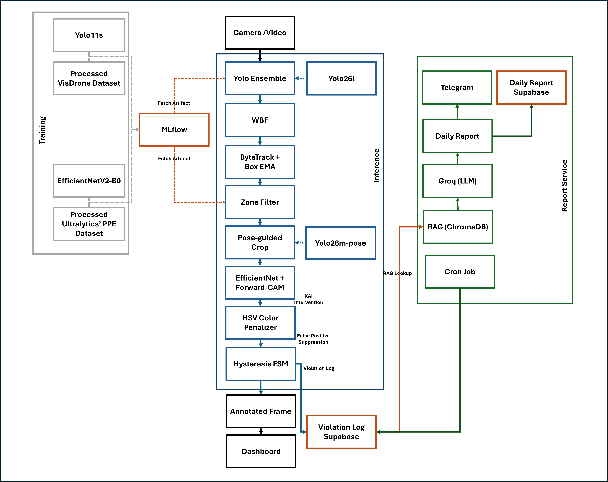

[](https://github.com/nhatminh-115/PPE-Detection/actions/workflows/ci-cd-pipeline.yml)


# PPE Detection

PPE Vision is a real-time, cloud-native inference engine designed for autonomous Personal Protective Equipment (PPE) compliance monitoring. Engineered for high-stakes construction and industrial environments, the system decouples complex Deep Learning inference from robust Data Observability and State Management.

---

## 1. System Architecture Overview 

The platform is designed around a microservices architecture, exposing a scalable FastAPI application that integrates natively with MLflow for dynamic artifact retrieval and Supabase for unstructured event logging.



### 1.1 Core AI Pipeline

**Stage 1: Spatial-Temporal Detection Ensemble**

To mitigate domain shift between varying camera angles (aerial vs. close-circuit), the system implements a dual-YOLO ensemble alongside a dedicated pose estimator:

* **Primary Detector:** YOLO11s fine-tuned on VisDrone for dense, small-scale pedestrian representations.
* **Secondary Detector:** COCO-pretrained `yolo26l.pt` for high-fidelity close-range features.
* **Pose Estimator:** `yolo26m-pose.pt` runs in parallel to extract 17 COCO body keypoints per person, updated every 9 frames to balance accuracy and throughput.
* **Fusion & Tracking:** Detections are fused using Weighted Boxes Fusion (WBF) to suppress redundant overlaps. Temporal continuity is maintained via ByteTrack coupled with a Box Exponential Moving Average (EMA) to eliminate spatial jittering.

**Zone-Based Spatial Filtering**

Before classification, detections are filtered through a user-defined polygon zone. Each person's foot-point (bottom-center of bounding box) is tested against the polygon via `cv2.pointPolygonTest`. Only persons whose foot-point falls inside the zone are passed downstream for PPE classification — eliminating irrelevant detections outside the monitored area.

**Stage 2: Pose-Guided PPE Classification**

Rather than cropping a fixed percentage of the bounding box, the system uses pose keypoints to precisely locate the region of interest before feeding it to the classifier:

* **Hardhat crop:** Head keypoints (nose, eyes, ears — COCO indices 0–4) define the crop region.
* **Vest crop:** Torso keypoints (shoulders, hips — COCO indices 5, 6, 11, 12) define the crop region.
* **Fallback:** If pose confidence is below threshold, the system falls back to a fixed percentage crop (top 40% for hardhat, 20–80% for vest).

Each crop is independently classified by **EfficientNetV2-B0** in a single batched forward pass. To ensure interpretability and suppress False Positives (e.g., misclassifying gray fabric as hardhats), the system implements a **Dual Forward-CAM** — one CAM head per class (hardhat and vest) — intercepting the `timm` feature extraction layer.

**HuggingFace Spaces demo:** [](https://huggingface.co/spaces/Nhatminh1234/ppe-classifier)


> **Left:** Without CAM — gray hardhat misclassified (WARN).
> **Right:** With CAM + HSV Penalizer — correctly identified as missing (MISS HARD).

The activated spatial regions are subjected to a **Dual-Channel HSV Color Penalizer**:

* **Value (Brightness) Penalty:** Regions with $V < 70$ receive a probability penalty (filtering dark hair/shadows).
* **Saturation Penalty:** Regions with $S < 80$ receive a small penalty (filtering gray concrete/clothing).

### 1.2 State Management & Observability

To prevent alert fatigue and database spamming caused by transient model uncertainty:

* **Hysteresis Finite State Machine (FSM):** Controls state transitions (SAFE → WARN → VIOLATION) with strict hysteresis margins to prevent oscillation.
* **Temporal Accumulation:** A violation must be sustained for a configurable duration before triggering an event.
* **Violation Cooldown:** Once a tracker ID is reported, a 5-minute cooldown prevents re-reporting the same person unless new violation types are detected.
* **Idempotent Event Logging:** Once validated, the violation is logged asynchronously (Fire-and-Forget ThreadPool) to a **Supabase PostgreSQL** instance using a flexible `JSONB` schema, accompanied by a localized crop image blob for manual auditing.
* **Instant Telegram Alert:** Each confirmed violation dispatches an immediate Telegram notification with the crop image attached.

### 1.3 Multi-Camera Architecture

The system supports simultaneous inference across an arbitrary number of camera sources via a **CameraRegistry** pattern:

* Each camera is registered dynamically and assigned a unique `cam_id` and `session_id`.
* Every camera spawns its own **dedicated inference thread** with isolated tracker, EMA, and FSM state — cameras are fully independent.
* A **producer-consumer pipeline** decouples frame I/O from GPU inference: the main thread reads frames into a bounded queue while the inference thread drains it continuously, eliminating GPU idle time.
* Streams are served individually at `/video_feed/{cam_id}` and composited into a responsive grid view in the UI.
* **Zone polygons** are stored per-camera and persist across stream restarts within a session.

---

## 2. Infrastructure

The infrastructure follows GitOps principles, ensuring the inference environment is fully version-controlled, reproducible, and seamlessly integrated with model training lifecycles.

* **Artifact Fetching:** The API dynamically fetches versioned `.pt` artifacts directly from the MLflow DagsHub Registry via uniquely identifiable `run_id`s, utilizing a local cache collision-avoidance mechanism.
* **GPU Acceleration:** All inference runs on CUDA via PyTorch. Models are warmed up at startup to avoid first-frame latency spikes. YOLO models are initialized with explicit `device=` to prevent CPU fallback.
* **Containerization:** The monolithic engine is packaged in a Docker image. Deployment via `docker-compose.yml` mounts persistent volumes for model cache and blob storage, enabling hardware-accelerated NVIDIA GPU passthrough.
* **Continuous Integration (CI):** GitHub Actions strictly governs the repository. The pipeline automatically provisions a mock environment and executes `pytest` using `unittest.mock` to validate API logic and endpoint integrity prior to Docker registry pushes.

---

## 3. Automated Reporting & Compliance Intelligence

### LLM Daily Report Service

An automated reporting pipeline runs daily at 23:00 ICT via GitHub Actions, pulling violation logs from Supabase, generating a narrative safety report via Groq (Llama 3.3 70B), and dispatching to Telegram.

**RAG-Augmented Regulation Context**

To ground report recommendations in actual Vietnamese labor law, the pipeline implements a Retrieval-Augmented Generation (RAG) layer:

* **Knowledge Base:** Thong tu 25/2022/TT-BLDTBXH — Ministry of Labor regulations on mandatory PPE by occupation (229 pages, 428 indexed chunks).
* **Embedding:** `paraphrase-multilingual-MiniLM-L12-v2` via ChromaDB with cosine similarity indexing.
* **Pipeline:** Violation types detected → auto-generated Vietnamese queries → top-k chunk retrieval → injected into Groq prompt as grounded context.

**Result:** Daily reports cite specific regulation articles and Phu luc I entries rather than generic safety advice.

| Component | Technology |
|---|---|
| LLM | Groq API (Llama 3.3 70B) |
| Vector Store | ChromaDB (persistent, cosine) |
| Embedding Model | sentence-transformers MiniLM-L12 |
| Scheduler | GitHub Actions cron (16:00 UTC) |
| Notification | Telegram Bot API |
| Storage | Supabase `daily_reports` table |

**Daily Report database (Supabase):**


**Telegram Report:**


---

## 4. Model Performance

### Stage 1: Detection Ensemble (VisDrone val set, 548 images)

| Model | Precision | Recall | mAP@50 | FPS |
|---|---|---|---|---|
| YOLO11s (fine-tuned) | 0.760 | 0.611 | 0.684 | 45.8 |
| YOLO26l (pretrained) | 0.590 | 0.356 | 0.418 | 22.3 |
| YOLO26m-pose (pretrained) | — | — | — | ~18* |
| **WBF Ensemble** | **0.556** | **0.764** | — | ~18** |

\* Pose model runs every 9 frames (POSE_EVERY=9); FPS represents average amortized cost.
\*\* End-to-end pipeline throughput with producer-consumer threading on NVIDIA RTX 5070.

> Ensemble design rationale: Higher recall (0.764 vs 0.611) prioritizes zero missed violations.
> Residual false positives are suppressed downstream by EfficientNetV2 + Dual Forward-CAM.

### Stage 2: PPE Classifier (Ultralytics PPE dataset)

| Model | Precision | Recall | F1 | FPS |
|---|---|---|---|---|
| EfficientNetV2-B0 | 0.97 | 0.88 | 0.92 | 39.1 |

> Benchmarked on NVIDIA RTX 5070 Laptop GPU, PyTorch 2.10, CUDA 12.8.
> Pose-guided crop strategy reduces false negatives on vest detection compared to fixed-percentage cropping.

### ONNX Export & CPU Optimization

EfficientNetV2-B0 exported to ONNX for cross-platform deployment.

| Format | Latency | Throughput | Size |
|---|---|---|---|
| PyTorch (CPU) | ~45 ms | ~22 FPS | 22.4 MB |
| ONNX FP32 (CPU) | 7.46 ms | 134 FPS | 22.4 MB |

> ONNX Runtime graph optimization yields ~6x speedup on CPU inference.
> Model artifact: [MLflow Run](https://dagshub.com/nhatminh-115/PPE-Detection.mlflow)

### LLM Report Quality

The daily report narrative is evaluated across 10 synthetic violation scenarios covering edge cases (night shift, repeat offenders, low confidence detections, mass violations). Evaluation performed via LLM-as-judge (Gemini 2.5 Pro).

| Criterion | Score |
|---|---|
| Factual Accuracy | 5.0 / 5 |
| Regulation Citation | 5.0 / 5 |
| Specificity | 5.0 / 5 |
| Actionability | 3.9 / 5 |
| Conciseness | 5.0 / 5 |
| **Overall** | **4.8 / 5** |

**EfficientNet Training Metrics**


**YOLO11s Training Metrics**


**Supabase Database**


**User Interface**


**Video Demo**

https://github.com/user-attachments/assets/7d18e0cb-dba9-4d97-8319-41e1005efcc8

---

## 5. Deployment Guide

### Prerequisites

* Docker Engine 24.0+ & Docker Compose
* NVIDIA Container Toolkit (for GPU inference)
* CUDA 12.8+ compatible driver
* Python 3.11+ (for local execution)

### Quick Start

1. **Clone & Configure:**
    ```bash
    git clone https://github.com/nhatminh-115/PPE-Detection.git
    cd PPE-Detection
    ```
    Create a `.env` file:
    ```env
    SUPABASE_URL=https://your-project.supabase.co
    SUPABASE_KEY=your_anon_key
    MLFLOW_TRACKING_URI=https://dagshub.com/nhatminh-115/PPE-Detection.mlflow
    GROQ_API_KEY=your_groq_key
    TELEGRAM_BOT_TOKEN=your_bot_token
    TELEGRAM_CHAT_ID=your_chat_id
    ```

2. **Provision Infrastructure:**
    ```bash
    docker-compose up --build -d
    ```

3. **Access Telemetry:**
    * **Dashboard SPA:** `http://localhost:8000/`
    * **Single Camera Feed:** `http://localhost:8000/video_feed`
    * **Per-Camera Feed:** `http://localhost:8000/video_feed/{cam_id}`
    * **Audit Logs:** `http://localhost:8000/api/violations`
    * **Camera Registry:** `http://localhost:8000/api/cameras`

### Multi-Camera Setup

```bash
# Add cameras via API
curl -X POST "http://localhost:8000/api/cameras/add_webcam?camera_index=0&label=Zone+A"
curl -X POST "http://localhost:8000/api/cameras/add_webcam?camera_index=1&label=Zone+B"
curl -X POST "http://localhost:8000/api/cameras/add_rtsp?url=rtsp://...&label=Gate+Camera"

# List active cameras
curl "http://localhost:8000/api/cameras"
```

Or use the dashboard UI: **Add** button → select Webcam or RTSP → assign label.

### Zone Definition

1. Add a camera and start the stream.
2. Hover over a camera cell → click **+ ZONE**.
3. The stream pauses on a frozen frame.
4. Click to place polygon vertices; click the first point to close.
5. Click **Save Zone** — inference resumes and only persons within the zone are checked.

### Alternative: Pre-built Docker Image

```bash
docker pull nhatminh115/ppe_system:latest
docker-compose up -d
```

*(View on [Docker Hub](https://hub.docker.com/r/nhatminh115/ppe_system))*

---

## 6. Future Roadmap: Closed-Loop MLOps

* **Infrastructure as Code (IaC) & Continuous Deployment (CD):** Transitioning from local Docker Compose to automated cloud provisioning on **AWS EC2** via **Terraform**, with zero-downtime immutable container deployments.
* **Data Drift Observability:** Implementing multivariate statistical hypothesis testing (Population Stability Index — PSI) on incoming video streams to monitor for covariate shift (lighting changes, new camera angles, seasonal variation).
* **Continuous Training (CT):** An automated feedback loop where verified data drift triggers retraining via GitHub Webhooks, updates the MLflow Model Registry, and promotes new weights to production without human intervention.

---

## 7. Related Work & Portfolio

* **[Cali Housing MLOps: From Manual to GitOps Architecture](https://github.com/nhatminh-115/cali-housing-mlops)** — foundational IaC and GitOps pipelines (Terraform, AWS EC2, closed-loop CT) planned for the Future Roadmap above.